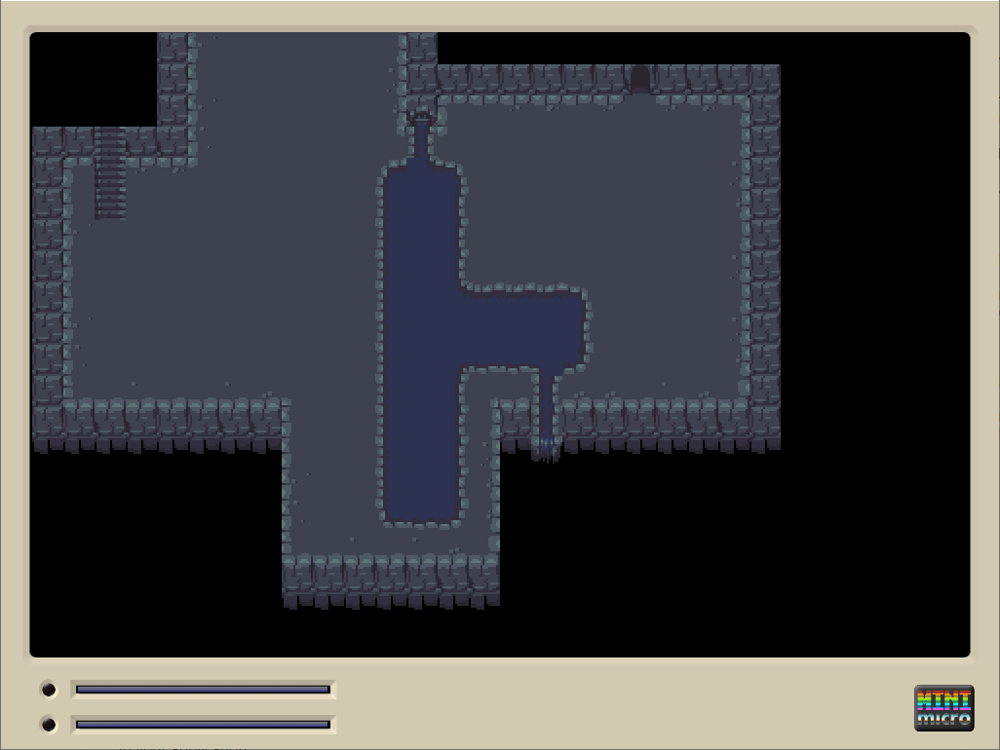

# minimicro-tiled

An importer of [Tiled](https://www.mapeditor.org/) JSON maps for the [mini-micro](https://miniscript.org/) system.

## Purpose
This libary is used to load and display [Tiled](https://www.mapeditor.org/) maps into [mini-micro](https://miniscript.org/)! Tiled is very useful to quickly create 2D tilemaps. With a few save file tweaks, one can quickly develop Tiled maps and view them in the game with a quick reload. 

Due to the nature of mini-micro, there are a few limitations on what features are supported from Tiled. 

## Usage
*minimicro-tiled* is easy to use! Simply put the *lib/* and *res/* folder in the root of your application.

In your application:

    import "lib/tiled/tiled"
    Tiled = locals["lib/tiled/tiled"]
    
    // ...  
    
    tlevel = Tiled.load("res/tilemaps/dungeon1.json", "res/tilemaps")
    if tlevel.error then
       print "Error loading tiled level: " + tlevel.error
       return
    end if
    
    //                    Tiled Layer, Display layer, Tileset img index
    tlevel.addRenderLayer 0          , 6            , 0
    tlevel.setZoom 2
    tlevel.render

> ***Note:***
> `load` and `render` are expensive functions. Only call them once per layer. You can call `render` again to change which image set or map data a layer is using, but it might hang the app for a sec. 

### Tiled Requirements / Limitations
There are a few features that aren't supported in mini-micro. Some might be implemented down the road.
 1. Map and tilemap must be saved in *json* format.
 2. Only one image (tilemap) can be used on a layer at a time. 
	 1. Tilemaps composed of individual images are not supported.
 3. Tile rotation is not supported. 
 4. Object layers are not supported. 
 5. Isometric tilesets are not supported *(yet?)*. 
 6. No compression/base64 support on tilemap data *(yet)*. 
 7. No meta data support on tiles *(yet)*. 

### Mini-Micro known issues
 1. While large maps can be loaded, they are progressively slower to load due to the nature of loading extremely large arrays. On a standard computer, a tiled map of 500x500 *(with 250,000 tiles overall)* can take about 20 - 30 seconds to load. 
 2. Only one image can be used per display / tiled layer. 
 3. Mini-Micro only has 7 display layers in total, so only 7 tiled layers can be used at a time.

> Written with [StackEdit](https://stackedit.io/).
